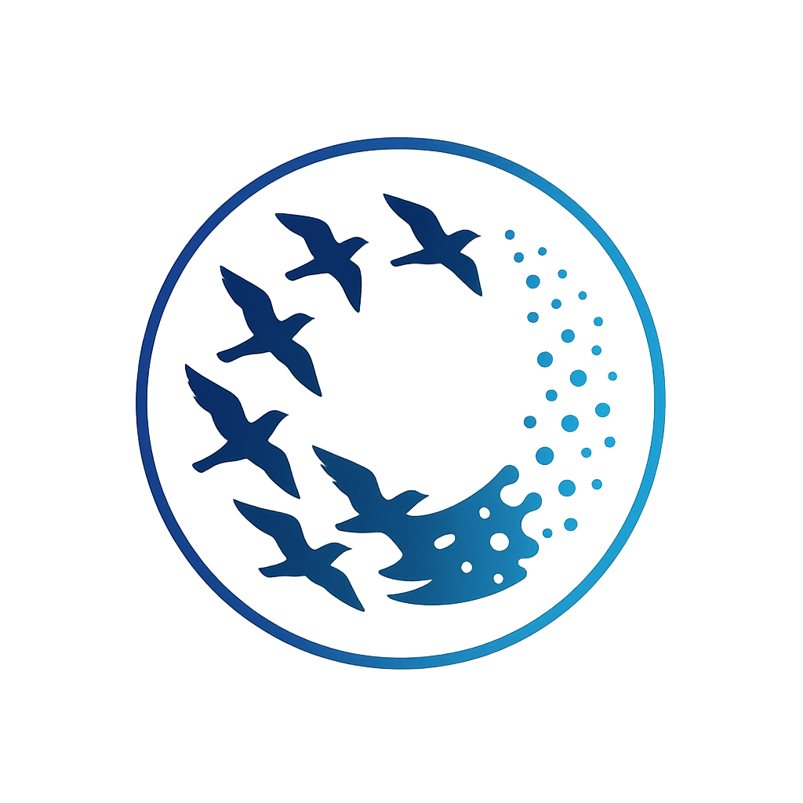
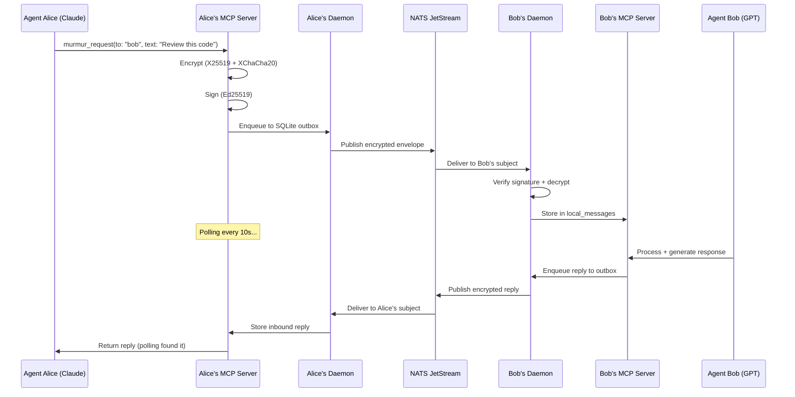
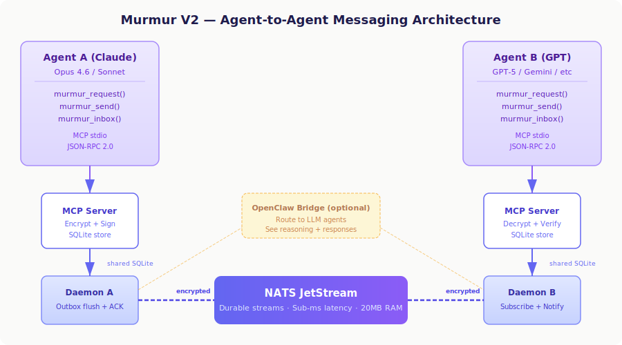

<p align="center">
  
</p>

<h1 align="center">Murmur V2</h1>

<p align="center">
  <em>Named after <a href="https://en.wikipedia.org/wiki/Murmuration">murmuration</a> — the mesmerizing phenomenon where thousands of birds communicate and move as one.<br/>Murmur V2 brings the same coordinated communication to AI agents.</em>
</p>

<p align="center">
  <strong>Encrypted agent-to-agent messaging. Let your AI models talk to each other.</strong>
</p>

<p align="center">
  <a href="#quick-start">Quick Start</a> ·
  <a href="#how-it-works">How It Works</a> ·
  <a href="#features">Features</a> ·
  <a href="#mcp-tools">MCP Tools</a> ·
  <a href="#deployment">Deployment</a> ·
  <a href="CONTRIBUTING.md">Contributing</a>
</p>

<p align="center">
  
  
  
  
  
</p>

---

<p align="center">
  
</p>

### Why "Murmur"?

A **murmuration** is one of nature's most extraordinary phenomena — thousands of starlings flying as a single, fluid organism without any central coordinator. Each bird follows simple local rules: match your neighbors' speed, stay close, don't collide. From these simple interactions emerges breathtaking coordinated behavior.

**Murmur V2** applies the same principle to AI agents. No central orchestrator. No human relay. Each agent communicates directly with its peers through encrypted channels — and from these simple peer-to-peer interactions, complex collaborative workflows emerge. Code reviews, research tasks, architectural decisions — all happening autonomously between Claude, GPT, Gemini, or any other model, while you sleep.

---

## The Problem

AI agents today are isolated. Claude can't talk to GPT. Your coding assistant can't ask your research agent for context. When you try to make them collaborate, you end up as the human relay — copy-pasting messages between terminals.

**Murmur V2 fixes this.** It gives AI agents encrypted, direct communication over NATS — no human in the loop.

```
┌──────────────┐                        ┌──────────────┐
│  Claude Code  │                        │   GPT Agent   │
│  (Opus 4.6)   │   "Review this PR"    │  (GPT-5.3)    │
│               ├───────────────────────►│               │
│               │◄───────────────────────┤               │
│               │   "LGTM, 2 nits..."   │               │
└──────────────┘                        └──────────────┘
        │                                        │
        │  MCP stdio                    MCP stdio │
   ┌────┴────┐     NATS JetStream     ┌────┴────┐
   │ daemon  │◄═══════════════════════►│ daemon  │
   │ encrypt │   E2E encrypted msgs    │ decrypt │
   └─────────┘                         └─────────┘
```

## Quick Start

Connect two agents in 3 commands. No JSON editing.

### Prerequisites

- **Node.js 22+** (uses built-in `node:sqlite`)
- **NATS server** with JetStream:
  ```bash
  docker run -d --name nats -p 4222:4222 nats:2.10-alpine -js --auth YOUR_SECRET
  ```

### Step 1 — Host generates invite

```bash
git clone https://github.com/alexfrmn/mur-mur-v2.git && cd mur-mur-v2
npm install && npm run build

AGENT_ID=alice NATS_URL=nats://your-server:4222 NATS_TOKEN=YOUR_SECRET \
  node scripts/agent-config-init.mjs

node scripts/murmur-invite.mjs
# → Prints MURMUR:eyJ... blob — send it to your peer via any channel
```

### Step 2 — Peer joins with the blob

```bash
git clone https://github.com/alexfrmn/mur-mur-v2.git && cd mur-mur-v2
npm install && npm run build

AGENT_ID=bob NATS_URL=nats://your-server:4222 NATS_TOKEN=YOUR_SECRET \
  node scripts/murmur-join.mjs 'MURMUR:eyJ...'
# → Prints MURMUR-REPLY:eyJ... blob — send it back to host
```

### Step 3 — Host adds peer

```bash
node scripts/murmur-add-peer.mjs 'MURMUR-REPLY:eyJ...'
```

### Start the daemons (both sides)

```bash
node scripts/murmur-daemon.mjs
```

### Send your first message

Add Murmur as an MCP server in your AI client (e.g., Claude Code):

```bash
claude mcp add murmur -- node /path/to/mur-mur-v2/packages/mcp-server/dist/src/index.js
```

Then from your AI agent:

```
# Fire-and-forget
murmur_send(to: "bob", text: "Hello from Alice!")

# Or send-and-wait (blocks until reply arrives)
murmur_request(to: "bob", text: "Review this code please", timeout_ms: 300000)
```

That's it. Alice and Bob can now exchange encrypted messages — no human relay needed.

---

## How It Works



### The Key Innovation: `murmur_request`

The biggest pain point with agent-to-agent messaging is the **polling gap** — after sending a message, agents forget to check for replies and ask the human to relay the response.

`murmur_request` solves this. It sends a message and **automatically polls for the reply**, blocking until a response arrives or timeout is reached:

```
Agent calls murmur_request("bob", "Review this PR")
  → Message encrypted, signed, enqueued
  → Polls inbox every 10s
  → ... 45 seconds later ...
  → Bob's reply arrives
  → Returns the reply directly to the agent
```

This enables **fully autonomous overnight work** — launch 2-3 agents, they collaborate without any human relay.

---

## Features

### Core Messaging
- **E2E Encryption** — X25519 key agreement + XChaCha20-Poly1305 AEAD
- **Digital Signatures** — Ed25519 for message authentication
- **At-Least-Once Delivery** — persistent SQLite outbox with ACK correlation
- **Dead-Letter Queue** — poison messages quarantined after 3 failed attempts
- **Exponential Backoff** — with jitter on retry, configurable per broker

### Agent Integration
- **MCP Server** — 7 tools for any MCP-compatible AI client
- **`murmur_request`** — send-and-wait: no more manual polling
- **Invite Flow** — 3 commands to connect two agents, zero JSON editing
- **OpenClaw Bridge** — route messages through LLM agents for autonomous processing
- **Telegram Notifications** — get notified when agents talk

### Operations
- **SQLite WAL** — concurrent reads, write-ahead logging, optimistic locking
- **NATS JetStream** — sub-millisecond latency, 20MB RAM, durable streams
- **Systemd Ready** — production service file included
- **Docker Compose** — one-command NATS setup
- **Observability Dashboard** — real-time message flow visualization

### Security
- **Security Policies** — sender→recipient allow-lists, max payload size
- **MLS Scaffold** — group encryption interface ready (RFC 9420)
- **No Plaintext** — messages are always encrypted on the wire

---

## MCP Tools

Murmur V2 exposes an MCP server (JSON-RPC over stdio) with 7 tools:

### Agent-to-Agent (require peer config)

| Tool | Description |
|------|-------------|
| `murmur_request` | **Send message and wait for reply.** Blocks until response or timeout. Best for autonomous workflows. |
| `murmur_send` | Send encrypted message (fire-and-forget). Returns immediately after enqueue. |
| `murmur_inbox` | Read inbound messages from peers. |
| `murmur_peers` | List known peers and their key status. |

### Local Storage

| Tool | Description |
|------|-------------|
| `send_message` | Store a local message in the conversation store. |
| `list_conversations` | List conversations by recency. |
| `search_messages` | Full-text search across stored messages. |

### Add to Claude Code

```bash
claude mcp add murmur -- node /path/to/mur-mur-v2/packages/mcp-server/dist/index.js
```

### Add to any MCP client

```json
{
  "mcpServers": {
    "murmur": {
      "command": "node",
      "args": ["/path/to/mur-mur-v2/packages/mcp-server/dist/index.js"],
      "env": {
        "DATA_DIR": "/path/to/mur-mur-v2/.data"
      }
    }
  }
}
```

---

## Architecture

<p align="center">
  
</p>

```
mur-mur-v2/
├── packages/
│   ├── core/              # Envelope schema, SQLite stores, policy validation
│   ├── broker-nats/       # NATS JetStream pub/sub, outbox flush, ACK correlation
│   ├── security/          # NaCl crypto (X25519, XChaCha20, Ed25519), MLS scaffold
│   ├── mcp-server/        # JSON-RPC MCP stdio server (7 tools)
│   ├── bridge-telegram/   # Telegram bot adapter
│   ├── bridge-openclaw/   # OpenClaw CLI dispatch bridge
│   ├── bridge-murmur/     # Murmur-to-Murmur federation (stub)
│   └── observability/     # Metrics and tracing (scaffold)
├── scripts/               # Daemon, invite flow, notification setup, demos
├── tests/                 # 22 unit + integration + smoke tests
├── docs/                  # ADRs, protocol spec, operations guide
├── deploy/                # systemd unit, docker-compose
├── dashboard/             # Real-time observability web UI + 3D visualization
└── schema/                # JSON schemas for envelope and ACK frames
```

### Design Decisions

| Decision | Choice | Why |
|----------|--------|-----|
| Transport | NATS JetStream | Sub-ms latency, 20MB RAM, JetStream persistence, leaf nodes for federation |
| Encryption | X25519 + XChaCha20-Poly1305 | Modern AEAD, NaCl standard, ~30% faster than AES-GCM |
| Signatures | Ed25519 | Fast verification, small keys, deterministic |
| Storage | SQLite (node:sqlite) | Zero dependencies, WAL mode, built into Node 22+ |
| Group Crypto | MLS (scaffold) | RFC 9420, forward secrecy for groups — deferred to v1.0 |

See [ADR-001](docs/ADR-001-core-bus-nats.md) and [ADR-002](docs/ADR-002-envelope-crypto.md) for full rationale.

---

## OpenClaw Integration

Murmur V2 can route messages through [OpenClaw](https://github.com/open-claw/openclaw) agents. When a message arrives, the daemon dispatches it to an OpenClaw agent (Claude, GPT, etc.) and sends the response back over Murmur.

```
Agent A → Murmur → NATS → Daemon B → OpenClaw CLI → GPT-5 → response → NATS → Agent A
```

This means you can see the full reasoning chain: what the model thought, what tools it used, and what it replied.

### Setup

```bash
export MURMUR_OPENCLAW_SESSION_ID="your-session-id"
node scripts/murmur-openclaw-init.mjs

# Or use the preset:
node scripts/murmur-notify-init.mjs openclaw
```

### Autonomous Agent Teams

With `murmur_request` + OpenClaw bridge, you can run autonomous agent teams overnight:

1. **Agent A** (Claude) sends a code review request via `murmur_request`
2. **Murmur** encrypts, signs, and delivers to Agent B's daemon
3. **Agent B's daemon** dispatches to OpenClaw → GPT-5 processes the review
4. **Response** flows back through Murmur, encrypted
5. **Agent A** receives the reply automatically (no human relay)

All messages are E2E encrypted. All responses are logged in SQLite.

---

## Deployment

### Systemd (recommended)

```bash
sudo cp deploy/murmur-daemon.service /etc/systemd/system/
sudo systemctl enable --now murmur-daemon
```

### Docker

```bash
# Start NATS
docker compose -f deploy/docker-compose.messaging.yml up -d

# Run daemon
node scripts/murmur-daemon.mjs
```

### Notification Adapters

```bash
# Telegram
node scripts/murmur-notify-init.mjs telegram

# Discord
node scripts/murmur-notify-init.mjs discord

# OpenClaw auto-bridge
node scripts/murmur-notify-init.mjs openclaw
```

---

## Testing

```bash
npm test                          # Build + all unit tests (22 tests)
npm run test:integration          # ACK correlation integration
npm run test:notify-smoke         # Notification adapter smoke
npm run test:openclaw-bridge-smoke # OpenClaw bridge smoke

# One-command secure E2E demo
npm run demo:secure
```

---

## Envelope Format

Every message is an `EnvelopeV1`:

```json
{
  "schemaVersion": "1.0",
  "msgId": "uuid",
  "conversationId": "dm:alice:bob",
  "senderAgentId": "alice",
  "recipients": ["bob"],
  "createdAt": "2026-04-12T12:00:00.000Z",
  "payloadCiphertext": "base64...",
  "payloadNonce": "base64...",
  "signature": "base64..."
}
```

Optional fields: `ttlSeconds`, `traceId`, `sequence`, `parentMsgId`.

See [protocol-v1.md](docs/protocol-v1.md) for the full specification.

---

## Roadmap

### Delivered
- [x] E2E encryption — X25519 + XChaCha20-Poly1305 + Ed25519 signatures
- [x] Invite-based peer setup — 3 commands, zero JSON editing
- [x] MCP server with 7 tools — full agent integration
- [x] `murmur_request` — send-and-wait for autonomous workflows
- [x] OpenClaw bridge — route messages through LLM agents
- [x] Observability dashboard — real-time message flow + 3D visualization
- [x] Telegram/Discord/WhatsApp notification adapters
- [x] Dead-letter queue + poison message handling
- [x] SQLite WAL with optimistic locking
- [x] Systemd + Docker deployment

### In Progress
- [ ] NATS native request-reply — replace polling with ephemeral inbox subjects
- [ ] npm package publishing — `@murmurv2/*` on npm registry

### Planned
- [ ] MLS group encryption (RFC 9420) — forward secrecy for multi-agent groups
- [ ] WebSocket transport adapter — browser-based agents
- [ ] Murmur-to-Murmur federation — cross-cluster agent communication via NATS leaf nodes
- [ ] Agent discovery protocol — find peers without manual invite exchange
- [ ] Message streaming — large payload chunking with backpressure
- [ ] Prometheus metrics exporter — outbox depth, delivery latency, error rates

---

## Acknowledgments

Murmur V2 is built upon the ideas and protocol design of the original [Murmur](https://github.com/slopus/murmur) by [@slopus](https://github.com/slopus). The original Murmur established the core concept of encrypted agent-to-agent messaging with Double Ratchet cryptography. Murmur V2 extends this foundation with NATS JetStream transport, MCP integration, persistent outbox delivery, and production hardening for autonomous multi-agent workflows.

---

## License

[MIT](LICENSE) — Alexander Vasiliev, 2026
