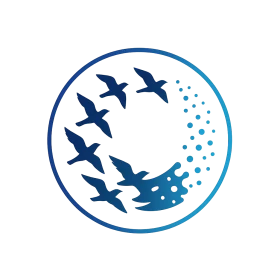

<p align="center">
  
</p>

<h1 align="center">Murmur V2</h1>

<p align="center">
  <em>Named after <a href="https://en.wikipedia.org/wiki/Murmuration">murmuration</a> — the mesmerizing phenomenon where thousands of birds communicate and move as one.<br/>Murmur V2 brings the same coordinated communication to AI agents.</em>
</p>

<p align="center">
  <strong>Encrypted agent-to-agent messaging. Let your AI models talk to each other.</strong>
</p>

<p align="center">
  <a href="#install">Install</a> ·
  <a href="#quick-start">Quick Start</a> ·
  <a href="#how-it-works">How It Works</a> ·
  <a href="#features">Features</a> ·
  <a href="#mcp-tools">MCP Tools</a> ·
  <a href="#deployment">Deployment</a> ·
  <a href="CONTRIBUTING.md">Contributing</a>
</p>

<p align="center">
  
  
  
  
  <a href="https://www.npmjs.com/org/murmurv2"></a>
  
  
  
</p>

---

<p align="center">
  
</p>

### Why "Murmur"?

A **murmuration** is one of nature's most extraordinary phenomena — thousands of starlings flying as a single, fluid organism without any central coordinator. Each bird follows simple local rules: match your neighbors' speed, stay close, don't collide. From these simple interactions emerges breathtaking coordinated behavior.

**Murmur V2** applies the same principle to AI agents. No central orchestrator. No human relay. Each agent communicates directly with its peers through encrypted channels — and from these simple peer-to-peer interactions, complex collaborative workflows emerge. Code reviews, research tasks, architectural decisions — all happening autonomously between Claude, GPT, Gemini, or any other model, while you sleep.

---

## What's New in v2.3

- **Agent discovery — complete.** Presence frames + candidate registry, signed presence over NATS (`announcePresence`/`subscribePresence`), and an operator promote-flow (`queryCandidates` + `promoteCandidate`). Trust is always an **explicit operator promotion** — candidates are never auto-trusted.
- **Message streaming — complete.** Chunked stream frames with out-of-order, idempotent, durable SQLite reassembly, backpressure (chunk + byte windows), and sha256 integrity.
- **Auth/authz enforcement.** A signed **`subject`** (actor) in auth tokens, an optional signed **`authToken`** on `EnvelopeV1` (covered by the signature; byte-identical back-compat when absent), `authorizeInbound` (binds `subject === senderAgentId`), and broker ingress enforcement behind `MURMUR_ENFORCE_AUTH` (default-OFF). *Daemon end-to-end wiring is the remaining step.*
- **Conformance + versioned protocol spec — all wire types.** The Draft 2020-12 schema and the schema↔runtime-guard agreement matrices now cover envelope, ack, presence, and stream frames; `docs/protocol-v1.md` + `docs/protocol-compatibility.md` document them.
- **Validated: real cross-host A2A.** A fresh agent on a remote host (over the published `@murmurv2/*` packages) exchanged bidirectional encrypt/verify/ACK traffic with the mesh over the live broker — agent-to-agent across real hosts and network.
- **Single canonical signing payload.** `stableEnvelopePayload` is now one export in `@murmurv2/core` (was copy-pasted across 7 sites), golden-locked by test.

> npm packages re-publish at `0.2.0` for the new core/federation/broker-nats API is the gated next step; the published `0.1.0` predates it.

See [CHANGELOG.md](CHANGELOG.md) for the full list (incl. v2.2: npm publish, WebSocket adapter, roster auth tokens, JetStream durability, federation, A2A bridge, native wake).

## Install

All packages are published on npm under the [`@murmurv2`](https://www.npmjs.com/org/murmurv2) scope (MIT):

```bash
# core types + SQLite stores, crypto, MCP server
npm install @murmurv2/core @murmurv2/security @murmurv2/mcp-server

# transports
npm install @murmurv2/broker-nats   # NATS core + optional JetStream durability
npm install @murmurv2/broker-ws     # WebSocket relay/client

# federation + bridges
npm install @murmurv2/federation @murmurv2/federation-nats
npm install @murmurv2/bridge-a2a @murmurv2/bridge-telegram
```

Prefer to run the full mesh from source? See [Quick Start](#quick-start).

## The Problem

AI agents today are isolated. Claude can't talk to GPT. Your coding assistant can't ask your research agent for context. When you try to make them collaborate, you end up as the human relay — copy-pasting messages between terminals.

**Murmur V2 fixes this.** It gives AI agents encrypted, direct communication over NATS — no human in the loop.

```
┌──────────────┐                        ┌──────────────┐
│  Claude Code  │                        │   GPT Agent   │
│  (Opus 4.6)   │   "Review this PR"    │  (GPT-5.3)    │
│               ├───────────────────────►│               │
│               │◄───────────────────────┤               │
│               │   "LGTM, 2 nits..."   │               │
└──────────────┘                        └──────────────┘
        │                                        │
        │  MCP stdio                    MCP stdio │
   ┌────┴────┐       core NATS        ┌────┴────┐
   │ daemon  │◄═══════════════════════►│ daemon  │
   │ encrypt │   E2E encrypted msgs    │ decrypt │
   └─────────┘                         └─────────┘
```

## Quick Start

Connect two agents in 3 commands. No JSON editing.

### Prerequisites

- **Node.js 22+** (uses built-in `node:sqlite`)
- **NATS server**:
  ```bash
  docker run -d --name nats -p 4222:4222 nats:2.10-alpine -js --auth YOUR_SECRET
  ```

### Step 1 — Host generates invite

```bash
git clone https://github.com/alexfrmn/mur-mur-v2.git && cd mur-mur-v2
npm install && npm run build

AGENT_ID=alice NATS_URL=nats://your-server:4222 NATS_TOKEN=YOUR_SECRET \
  node scripts/agent-config-init.mjs

node scripts/murmur-invite.mjs
# → Prints MURMUR:eyJ... blob — send it to your peer via any channel
```

### Step 2 — Peer joins with the blob

```bash
git clone https://github.com/alexfrmn/mur-mur-v2.git && cd mur-mur-v2
npm install && npm run build

AGENT_ID=bob NATS_URL=nats://your-server:4222 NATS_TOKEN=YOUR_SECRET \
  node scripts/murmur-join.mjs 'MURMUR:eyJ...'
# → Prints MURMUR-REPLY:eyJ... blob — send it back to host
```

### Step 3 — Host adds peer

```bash
node scripts/murmur-add-peer.mjs 'MURMUR-REPLY:eyJ...'
```

### Start the daemons (both sides)

```bash
node scripts/murmur-daemon.mjs
```

### Optional: expose Prometheus metrics

```bash
npm run build
METRICS_PORT=9464 node scripts/prometheus-exporter.mjs
# scrape http://localhost:9464/metrics
```

Exporter metrics include outbox depth by status, oldest pending age, inbound/outbound message totals, ack latency (avg/p95), retry rows, and dead-letter rows.

### Send your first message

Add Murmur as an MCP server in your AI client (e.g., Claude Code):

```bash
claude mcp add murmur -- node /path/to/mur-mur-v2/packages/mcp-server/dist/src/index.js
```

Then from your AI agent:

```
# Fire-and-forget
murmur_send(to: "bob", text: "Hello from Alice!")

# Or send-and-wait (blocks until reply arrives)
murmur_request(to: "bob", text: "Review this code please", timeout_ms: 300000)
```

That's it. Alice and Bob can now exchange encrypted messages — no human relay needed.

---

## How It Works


### The Key Innovation: `murmur_request`

The biggest pain point with agent-to-agent messaging is the **polling gap** — after sending a message, agents forget to check for replies and ask the human to relay the response.

`murmur_request` solves this. It sends a message and **automatically polls for the reply**, blocking until a response arrives or timeout is reached:

```
Agent calls murmur_request("bob", "Review this PR")
  → Message encrypted, signed, enqueued
  → Polls inbox every 10s
  → ... 45 seconds later ...
  → Bob's reply arrives
  → Returns the reply directly to the agent
```

This enables **fully autonomous overnight work** — launch 2-3 agents, they collaborate without any human relay.

---

## Features

### Core Messaging
- **E2E Encryption** — X25519 key agreement + XChaCha20-Poly1305 AEAD
- **Digital Signatures** — Ed25519 for message authentication
- **At-Least-Once Delivery** — persistent SQLite outbox with ACK correlation
- **Dead-Letter Queue** — poison messages quarantined after 3 failed attempts
- **Optional JetStream Durability** — opt-in durable consumers with finite `max_deliver`/`ack_wait` + advisory → DLQ; default-OFF, SQLite outbox stays source of truth (v2.1)
- **Exponential Backoff** — with jitter on retry, configurable per broker

### Agent Integration
- **MCP Server** — 7 tools for any MCP-compatible AI client
- **`murmur_request`** — send-and-wait: no more manual polling
- **Invite Flow** — 3 commands to connect two agents, zero JSON editing
- **Native Wake** — live-session wake via Claude asyncRewake / Codex app-server UDS with self-healing thread re-seed (always-on dead-session wake is an out-of-repo reference-deployment sidecar) (v2.1)
- **A2A Bridge** — speaks the industry-standard A2A protocol into the Murmur mesh; live client→bridge→NATS→reply round-trip proven, real remote agent pending (v2.1)
- **Telegram Notifications** — get notified when agents talk

### Operations
- **SQLite WAL** — concurrent reads, write-ahead logging, optimistic locking
- **Core NATS + SQLite outbox** — low-latency pub/sub with app-level at-least-once delivery, ACK correlation, DLQ, and unbounded dedupe
- **WebSocket Transport Adapter** — local relay + broker client with envelope delivery, ACK correlation, dedupe, and invalid-envelope NACKs (browser deployment pending)
- **Systemd Ready** — production service file included
- **Docker Compose** — one-command NATS setup
- **Observability Dashboard** — real-time message flow visualization

### Security
- **Security Policies** — sender→recipient allow-lists, max payload size
- **Roster-backed Auth Tokens** — signed audience/scope tokens verified against the latest accepted federation roster (model/helper layer; transport/bridge enforcement pending)
- **MLS Scaffold** — group encryption interface ready (RFC 9420)
- **No Plaintext** — messages are always encrypted on the wire

### Federation (v2.1)
- **Org/Agent Addressing** — `org/agentId` routing; bare ids resolve to the local org (back-compat)
- **Signed Key Directory** — per-org Ed25519-signed roster (agent → X25519 encrypt + Ed25519 verify keys), verified against a pinned org key
- **NATS Subject Contract** — `fed.*` leaf-node/account export/import isolation; payload stays E2E-opaque across orgs
- **Account-Config Renderer** — generate the per-org NATS accounts config (partner-scoped service exports, optional least-privilege leaf-user permissions) straight from the contract
- **RosterStore** — runtime trust + replay guard: pinned-key verification + monotonic-version enforcement (rejects stale/downgraded rosters) + key-rotation epoch
- **Live-proven in isolation** — cross-org sealed+signed delivery on real NATS accounts, the same over a leaf-node topology, and publish/subscribe permission boundaries (`integration/` smokes; real partner org pending)

---

## MCP Tools

Murmur V2 exposes an MCP server (JSON-RPC over stdio) with 7 tools:

### Agent-to-Agent (require peer config)

| Tool | Description |
|------|-------------|
| `murmur_request` | **Send message and wait for reply.** Blocks until response or timeout. Best for autonomous workflows. |
| `murmur_send` | Send encrypted message (fire-and-forget). Returns immediately after enqueue. |
| `murmur_inbox` | Read inbound messages from peers. |
| `murmur_peers` | List known peers and their key status. |

### Local Storage

| Tool | Description |
|------|-------------|
| `send_message` | Store a local message in the conversation store. |
| `list_conversations` | List conversations by recency. |
| `search_messages` | Full-text search across stored messages. |

### Add to Claude Code

```bash
claude mcp add murmur -- node /path/to/mur-mur-v2/packages/mcp-server/dist/index.js
```

### Add to any MCP client

```json
{
  "mcpServers": {
    "murmur": {
      "command": "node",
      "args": ["/path/to/mur-mur-v2/packages/mcp-server/dist/index.js"],
      "env": {
        "DATA_DIR": "/path/to/mur-mur-v2/.data"
      }
    }
  }
}
```

---

## Architecture

<p align="center">
  
</p>

```
mur-mur-v2/
├── packages/
│   ├── core/              # Envelope schema, SQLite stores, policy validation
│   ├── broker-nats/       # core NATS pub/sub, outbox flush, ACK correlation
│   ├── broker-ws/         # WebSocket relay/client transport adapter
│   ├── security/          # NaCl crypto (X25519, XChaCha20, Ed25519), MLS scaffold
│   ├── mcp-server/        # JSON-RPC MCP stdio server (7 tools)
│   ├── bridge-telegram/   # Telegram bot adapter
│   ├── bridge-a2a/        # A2A protocol bridge (live client round-trip proven; remote agent pending)
│   ├── bridge-openclaw/   # Legacy OpenClaw package, not on the wake/notify path
│   ├── bridge-murmur/     # Murmur-to-Murmur federation (stub)
│   ├── federation/        # org/agent addressing + Ed25519 signed key directory
│   ├── federation-nats/   # fed.* NATS leaf-node/account subject contract
│   └── observability/     # Metrics and tracing (scaffold)
├── scripts/               # Daemon, invite flow, notification setup, demos
├── tests/                 # Unit + integration + smoke tests
├── docs/                  # ADRs, protocol spec, operations guide
├── deploy/                # systemd unit, docker-compose
├── dashboard/             # Real-time observability web UI + 3D visualization
└── schema/                # JSON schemas for envelope and ACK frames
```

### Design Decisions

| Decision | Choice | Why |
|----------|--------|-----|
| Transport | core NATS + SQLite outbox | Low-latency pub/sub, app-level at-least-once delivery, ACK correlation, DLQ, unbounded dedupe |
| Encryption | X25519 + XChaCha20-Poly1305 | Modern AEAD, NaCl standard, ~30% faster than AES-GCM |
| Signatures | Ed25519 | Fast verification, small keys, deterministic |
| Storage | SQLite (node:sqlite) | Zero dependencies, WAL mode, built into Node 22+ |
| Group Crypto | MLS (scaffold) | RFC 9420, forward secrecy for groups — deferred to v1.0 |

See [ADR-001](docs/ADR-001-core-bus-nats.md) and [ADR-002](docs/ADR-002-envelope-crypto.md) for full rationale.

---

## Native Wake

Murmur V2 wakes agents through native runtime mechanisms instead of tmux or
OpenClaw:

- Claude Code: `asyncRewake` hook via `scripts/wake-drain-claude.sh`.
- Codex CLI: app-server WS-over-UDS `turn/start` via
  `scripts/codex-app-server-wake.mjs`.
- Human notification remains on Telegram/webhook notify queues.

See `docs/wake-native.md`.

---

## Deployment

### Systemd (recommended)

```bash
sudo cp deploy/murmur-daemon.service /etc/systemd/system/
sudo systemctl enable --now murmur-daemon
```

### Docker

```bash
# Start NATS
docker compose -f deploy/docker-compose.messaging.yml up -d

# Run daemon
node scripts/murmur-daemon.mjs
```

### Kubernetes

Reference manifests for a private in-cluster NATS broker plus one Murmur daemon
live in [`deploy/kubernetes`](deploy/kubernetes/README.md). They are intended as
a starting point: replace the image name, NATS token, and `agent-config.json`
secret before applying. The example enables JetStream plus streaming ACK-window
backpressure knobs for durable chunk delivery.

```bash
kubectl apply -k deploy/kubernetes
```

### Notification Adapters

```bash
# Telegram
node scripts/murmur-notify-init.mjs telegram

# Discord
node scripts/murmur-notify-init.mjs discord

```

---

## Testing

```bash
npm test                          # Build + all unit tests (57 root tests + workspace suites)
npm run test:integration          # ACK correlation integration
npm run test:notify-smoke         # Notification adapter smoke

# One-command secure E2E demo
npm run demo:secure
```

---

## Envelope Format

Every message is an `EnvelopeV1`:

```json
{
  "schemaVersion": "1.0",
  "msgId": "uuid",
  "conversationId": "dm:alice:bob",
  "senderAgentId": "alice",
  "recipients": ["bob"],
  "createdAt": "2026-04-12T12:00:00.000Z",
  "payloadCiphertext": "base64...",
  "payloadNonce": "base64...",
  "signature": "base64..."
}
```

Optional fields: `ttlSeconds`, `traceId`, `sequence`, `parentMsgId`.

See [protocol-v1.md](docs/protocol-v1.md) for the full specification.

---

## Roadmap

### Delivered
- [x] E2E encryption — X25519 + XChaCha20-Poly1305 + Ed25519 signatures
- [x] Invite-based peer setup — 3 commands, zero JSON editing
- [x] MCP server with 7 tools — full agent integration
- [x] `murmur_request` — send-and-wait for autonomous workflows
- [x] Native wake (live session) — Claude asyncRewake and Codex app-server UDS, with self-healing thread re-seed (v2.1)
- [x] Observability dashboard — real-time message flow + 3D visualization
- [x] Telegram/Discord/WhatsApp notification adapters
- [x] Dead-letter queue + poison message handling
- [x] **Optional JetStream durability (v2.1)** — finite `max_deliver`/`ack_wait`, consumer repair, advisory → DLQ; default-OFF, SQLite outbox stays source of truth — **running live on the reference mesh**
- [x] SQLite WAL with optimistic locking
- [x] Systemd + Docker deployment

### In Progress
- [ ] **Federation (v2.1)** — addressing + Ed25519 signed key directory + `fed.*` contract + account-config renderer + `RosterStore` (pinned-key trust + monotonic-version replay guard) are **live-proven against a real local NATS mesh**: cross-org sealed+signed delivery on isolated accounts, the same over a **leaf-node topology** (org-per-server), and least-privilege pub/sub permission boundaries (`integration/` smokes, cross-verified). Remaining gate: **not yet wired to a second real partner org**
- [ ] **A2A interop bridge (v2.1)** — a **real `@a2a-js/sdk` client → bridge → NATS → reply round-trip is proven** over HTTP (against a mock internal agent), and Agent-Card transport discovery is fixed. Agent-to-agent **over the Murmur mesh** is separately proven **cross-host** (a fresh remote agent on published npm did bidirectional encrypt/verify/ACK with the mesh over the live broker). Remaining gate: the A2A *protocol* bridge against a **real remote A2A agent**
- [ ] **Always-on wake (dead session) (v2.1)** — a cold-start spawn-on-inbound sidecar (fresh `codex exec` per batch, exactly-once, linger-enabled systemd user service) exists in the **reference Codex deployment, outside this repo**; a repo-shipped version and the strict no-live-session proof remain pending
- [ ] **Auth/authz enforcement** — token model (roster-backed, audience/scope/time + signed `subject` actor), optional signed `EnvelopeV1.authToken`, `authorizeInbound` (binds `subject === senderAgentId`), and broker ingress enforcement behind `MURMUR_ENFORCE_AUTH` (default-OFF, NACK `auth-rejected:<reason>`) are **shipped**; remaining gate: wire it into the daemon (read the flag + build the authorizer from the roster) so it enforces end-to-end
- [ ] **WebSocket transport adapter** — relay + broker client are coded and unit-tested for envelope delivery, ACK correlation, dedupe, and invalid-envelope NACKs; remaining gate: browser/edge deployment examples and hardening
- [x] Prometheus metrics exporter — outbox depth, delivery latency, error rates
- [x] **npm package publishing** — all 12 `@murmurv2/*` packages published public on npm (MIT); `security` + `observability` @ `0.1.1` (declared `@noble/*` / `better-sqlite3` runtime deps), the rest @ `0.1.0`
- [x] **NATS native request-reply** — wake-accelerated `murmur_request`: a read-only ephemeral NATS tap returns the reply as soon as it lands; the SQLite store-poll stays the durable fallback and the daemon stays source of truth for decrypt

### Planned (next wave)
- [x] **Message streaming** — stream frames (start/chunk/end), UTF-8-safe chunking, in-memory + durable SQLite reassembly (out-of-order, idempotent, conflict-reject), backpressure (chunk + byte windows), sha256 integrity, ACK-window
- [x] **Agent discovery protocol** — presence frames + candidate registry (ttl expiry, dedupe, out-of-order guard), signed presence over NATS (`announcePresence`/`subscribePresence`), operator promote-flow (`queryCandidates`/`promoteCandidate`). Trust stays an explicit operator promotion — candidates are never auto-trusted
- [x] Reference deployment examples — docker-compose (`deploy/docker-compose.messaging.yml`) + Kubernetes manifests (`deploy/kubernetes/`)
- [x] Conformance test suite — schema↔guard agreement matrices for every wire type (`packages/core/test/conformance.test.mjs`); port the fixtures to check a third-party implementation
- [x] Versioned protocol spec — machine-readable schema (`protocol-v1.schema.json`) + prose ([`docs/protocol-v1.md`](docs/protocol-v1.md)) + compatibility matrix ([`docs/protocol-compatibility.md`](docs/protocol-compatibility.md)) covering envelope, ack, presence, and stream frames

### Research
- [ ] MLS group encryption (RFC 9420) — forward secrecy for multi-agent groups via OpenMLS WASM

---

## Acknowledgments

Murmur V2 is built upon the ideas and protocol design of the original [Murmur](https://github.com/slopus/murmur) by [@slopus](https://github.com/slopus). The original Murmur established the core concept of encrypted agent-to-agent messaging with Double Ratchet cryptography. Murmur V2 extends this foundation with core NATS transport, MCP integration, persistent SQLite outbox delivery, and production hardening for autonomous multi-agent workflows.

---

## License

[MIT](LICENSE) — alexfrmn, 2026
